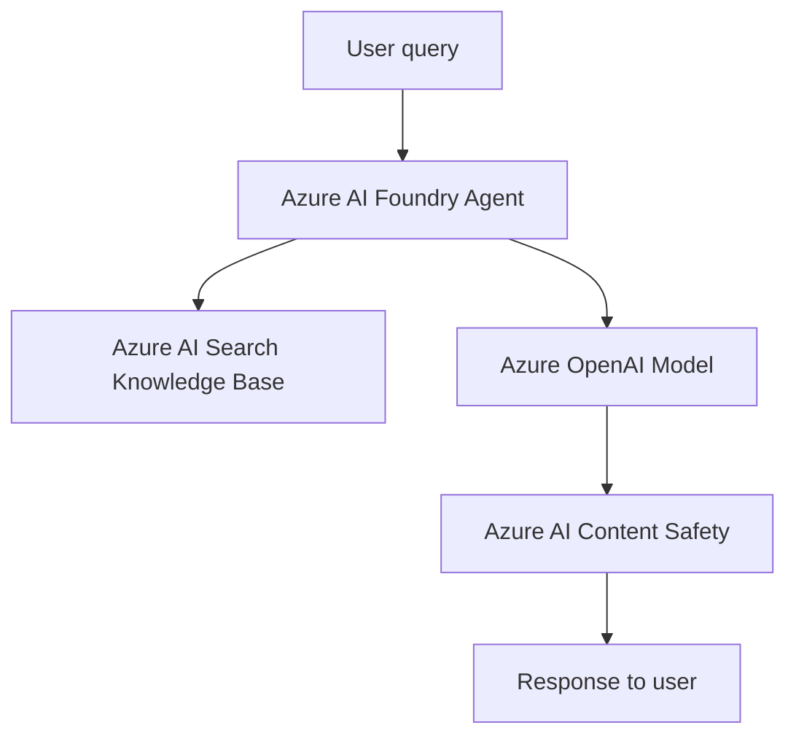

# Writing documentation files

This instruction file explains how to write documentation files in Markdown for this repository. The guidance applies to all Markdown documentation files and study notes.

The goal is to make documentation easy to read, easy to scan, and easy to understand for readers who want clear, concise certification preparation notes, including non-native English speakers.

## What this file covers

- How to structure a Markdown document.
- How to write clearly and briefly.
- How to reduce noise and vague language.
- How to use visual elements such as tables and diagrams.
- How to handle source material and external links.

## Keep it simple and helpful

Use short sentences and short paragraphs. Write as if you are helping someone who is studying or reviewing the topic.

- Use plain words instead of fancy words.
- Use active voice: say who does what.
- Use second person when you give guidance: use "you".
- Use the Oxford comma in lists when it makes the meaning clearer.
- Avoid unnecessary jargon and buzzwords.
- Avoid filler phrases like "in order to", "as a matter of fact", and "please note".

### Language examples

| Better | Worse |
| --- | --- |
| Use Azure AI Search to index documents for RAG. | In order to implement a RAG pattern, you should consider using Azure AI Search. |
| Store API keys in Azure Key Vault. | It is recommended that you store API keys in Azure Key Vault when possible. |

## Start with a clear purpose

Each Markdown file should answer one or two main questions. Ask yourself:

- Who is this document for?
- What should the reader learn or take away for the certification?
- What is the most important concept or service behavior?

When the purpose is clear, the document is easier to follow and review.

## Use structure that helps scanning

Good structure makes documents easier to scan. Use headings, lists, and tables instead of long blocks of text.

### Recommended structure for study and reference pages

1. Summary or purpose (one to two sentences)
2. When the topic or service matters
3. Core concepts, capabilities, or service purpose
4. Relationships to other Azure services (with diagrams where appropriate)
5. Certification notes, key tradeoffs, or limits
6. Official Microsoft documentation links

### Heading rules

- Use sentence case for headings.
- Use one `#` heading per page.
- Use `##` for major sections and `###` for subsections.
- Make headings descriptive.
- Do not use headings only to make text look bigger.

### Markdown formatting

- Use inline code formatting with backticks for filenames, commands, API names, endpoints, and literal values.
- Use fenced code blocks for examples and include the language identifier when possible (`json`, `yaml`, `bash`, `python`, etc.).
- Use bold for interface elements or important terms, and use italics sparingly for emphasis only.
- Use tables for comparisons, service options, or structured data, not for visual styling.
- Avoid raw HTML in Markdown files unless the rendering target requires it.
- Use consistent bullet and numbered list styles, and keep lists short and scannable.

### Link text

- Use descriptive link text that explains where the link goes or what the reader will find.
- Avoid generic link text such as `click here`, `read more`, `see this`, or simply the file name when the file name is not helpful.
- Prefer natural phrasing, such as "For details on authentication, see the Microsoft Entra ID reference."
- Do not put links in headings; put link text in body copy instead.
- Use relative links for documentation within the repository when possible.

Good examples:

- [Azure AI Foundry documentation](https://learn.microsoft.com/azure/ai-studio/)
- [Glossary of terms](../../docs/glossary.md)
- [Azure services overview](../../docs/azure-services/README.md)

Bad examples:

- Generic link text such as "here" or "read more".
- A link label that only says "docs".

### Heading examples

Bad heading:

```markdown
## Notes
```

Better heading:

```markdown
## Key differences between Azure OpenAI and Azure AI Services
```

## Reduce cognitive load with clear visuals

Visual elements are helpful when they explain relationships, pipelines, or decision trees. Use them when they make the information easier to understand.

### Use tables for comparison

Tables work well for showing differences between services, SKUs, pricing tiers, or decision factors.

### Use code blocks for examples

Show concrete examples in JSON, YAML, Python, or shell code blocks. Always explain what the example demonstrates.

### Use diagrams for flow or structure

Use simple diagrams when a relationship or workflow is hard to explain in text alone. Use Mermaid when needed.

**Direction:** prefer `graph TD` (top-down) over `graph LR` (left-right). Top-down diagrams fit narrow screens better and match the vertical reading direction of the page. Use `graph LR` only when the content is a left-to-right processing pipeline where the horizontal direction carries essential meaning.

**Sequence interactions:** use `sequenceDiagram` for ordered message exchanges between agents, clients, and services. Sequence diagrams are top-down by nature.

**Renderer compatibility:** use `graph` syntax instead of `flowchart` syntax for maximum compatibility across Markdown viewers and git hosts.



## Avoid noise and vague language

Remove extra words and any phrase that does not add meaning. Avoid filler words like:

- basically
- frankly
- simply
- obviously
- hopefully
- very
- quite

Replace vague descriptions with concrete facts.

### Language noise examples

Bad:

> You should basically use Azure AI Content Safety whenever you are building an AI app if possible.

Better:

> Use Azure AI Content Safety to detect and filter harmful input prompts and generated responses.

## Use examples early

Show a concrete scenario or comparison near the top of the document. Examples help readers understand quickly. When explaining service selection, contrast a recommended scenario with an anti-pattern.

## Write for global readers

Many readers are not native English speakers. Write in a way that is easy to translate and easy to understand.

- Use standard spelling.
- Avoid idioms and slang.
- Avoid culture-specific references.
- Avoid long sentences.
- Use one idea per sentence.

## Source handling and originality

- **Never copy Microsoft Learn content verbatim.** Summarize concepts in original words.
- Brief descriptions of Azure services are allowed when they are accurate, original, and linked to authoritative Microsoft documentation.
- When citing product capabilities, quotas, limits, or supported models, link directly to the official Microsoft documentation page.

## Review and revise

Great documentation is usually rewritten. After writing or modifying a page, perform these checks:

- Does the first sentence explain the main idea?
- Does each heading describe the section clearly?
- Can any sentence be shorter?
- Is there any jargon that can be simplified or linked to the glossary?
- Are links working and descriptive?
- Is all text original and free of copied external passages?

## Keep documentation synchronized with content and structure

Review related documentation whenever a change adds, renames, or restructures content:

- Update the top-level `README.md` and folder READMEs when new modules, services, or reference folders are added.
- Update `docs/progress.md` when completing milestones or starting new tasks.
- Update `docs/glossary.md` when introducing new acronyms or Azure AI concepts.
- Update cross-references and links across module and service pages in the same change.
- Remove obsolete paths, renamed service names, or stale links.
- Check that all relative links resolve to existing files.

## Useful sources

- [Google developer documentation style guide](https://developers.google.com/style)
- [Microsoft Writing Style Guide](https://learn.microsoft.com/en-us/style-guide/)
- [On Writing Well](https://www.goodreads.com/book/show/16149296-on-writing-well)
- [Smart Brevity](https://www.goodreads.com/book/show/65389153-smart-brevity)

## How to use this instruction file

This file is a reference for writing Markdown documentation in this repository. When you write or update documentation, follow these principles and maintain high standards for clarity, structure, and original content.
