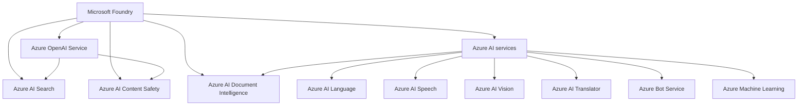

# Azure services

This folder contains one page or folder for each Azure service that matters to AI-103 study.

Each service page should explain the service purpose, where it fits in AI-103 content, how it relates to other services, and the official Microsoft links used as sources. Use this page as the entry point, then open the service pages for the relationship details.

## Service map

Use this table as the index for the AI services most likely to matter in AI-103 study. If a service needs more than a short mention, add or link a dedicated page from here.

| Service | Brief purpose |
| --- | --- |
| [Microsoft Foundry](azure-ai-foundry.md) | Build, organize, and govern AI apps and agents. |
| [Azure OpenAI Service](azure-openai.md) | Call Azure-hosted models for chat, generation, and embeddings. |
| [Azure AI Search](azure-ai-search.md) | Retrieve and ground answers with text, vector, and hybrid search. |
| [Azure AI Content Safety](azure-ai-content-safety.md) | Detect and filter harmful text and images. |
| [Azure AI Document Intelligence](azure-ai-document-intelligence.md) | Extract structured data from documents. |
| [Azure AI Language](azure-ai-language.md) | Work with text understanding and language tasks. |
| [Azure AI Speech](azure-ai-speech.md) | Convert speech to text and text to speech. |
| [Azure AI Vision](azure-ai-vision.md) | Analyze images and visual content. |
| [Azure AI Translator](azure-ai-translator.md) | Translate text across languages. |
| [Azure Bot Service](azure-bot-service.md) | Host bot experiences and channel connections. |
| [Azure Machine Learning](azure-machine-learning.md) | Train, manage, and deploy ML workloads. |

## Service relationships

The diagram shows the core AI services and how they connect in common AI-103 scenarios. Use it to answer questions about which service builds the app, which service grounds answers, which service extracts document content, and which service handles content safety. The detailed relationship notes now live on each service page, including the shared-resource pattern on the Foundry page.
