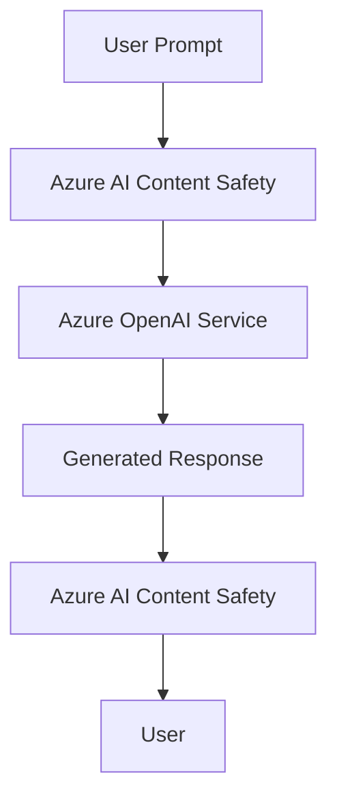

# Azure AI Content Safety

Azure AI Content Safety helps detect and filter harmful or risky text and images. In AI-103, it is the safety layer you add when the solution must review both user prompts and generated output.

## Role in AI-103

Use Azure AI Content Safety when the scenario involves moderation, jailbreak risk detection, or other safety checks around model input and output. It is usually a supporting service rather than the main user-facing experience.

## Key capabilities

- Text and image moderation: Checks text and images for harmful or risky content.
- Harm category detection: Flags content that matches safety categories such as violence, hate, or self-harm.
- Prompt risk checks for user input: Screens incoming prompts before they reach the model.
- Output filtering for generated content: Reviews model responses before the app shows them.

## Relationships to other services

| Service | Relationship |
| --- | --- |
| Azure OpenAI Service | Checks prompts or responses around model calls. |
| Microsoft Foundry | Adds a safety layer to agent and app workflows. |
| Azure AI Search | Helps protect search-backed apps that process untrusted content. |

Content Safety usually wraps the prompt-response path.

- Check prompts before the model call and responses before they return to the user.
- Use it when the workflow needs moderation, jailbreak detection, or output filtering.

## Security and identity

- Use Microsoft Entra ID where the app flow supports it.
- Store keys and endpoints in Azure Key Vault.
- Treat moderation settings as part of the app's governance model.

## Trade-offs and limits

| Consideration | Why it matters |
| --- | --- |
| False positives | Overly strict settings can block valid content. |
| False negatives | Weak settings can miss risky text or images. |
| Workflow placement | You may need checks before the model call, after the model call, or both. |

## Official references

- [Azure AI Content Safety documentation](https://learn.microsoft.com/azure/ai-services/content-safety/)
- [Harm categories](https://learn.microsoft.com/azure/ai-services/content-safety/concepts/harm-categories)
- [Prompt Shields](https://learn.microsoft.com/azure/ai-services/content-safety/concepts/jailbreak-detection)