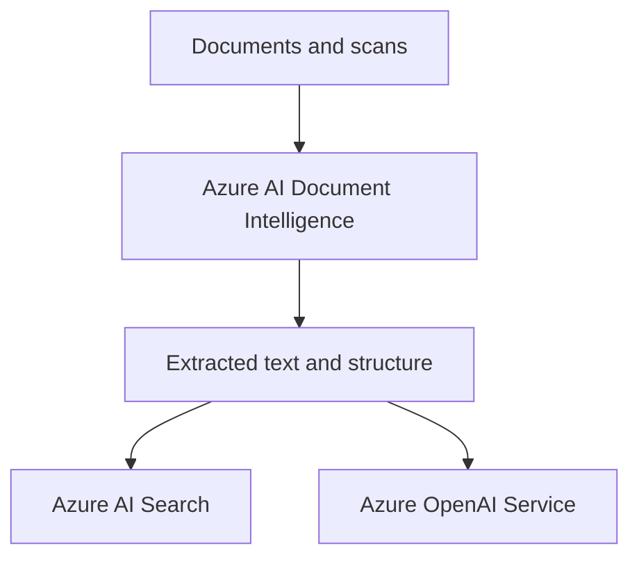

# Azure AI Document Intelligence

Azure AI Document Intelligence extracts text, tables, key-value pairs, and layout structure from documents. In AI-103, it helps you turn unstructured files into data that an app, agent, or search index can use.

## Role in AI-103

Use Azure AI Document Intelligence when the scenario starts with files such as invoices, forms, receipts, contracts, or scanned pages. It is a strong fit when the exam question asks how to extract structured data before sending it to Azure AI Search, Azure OpenAI Service, or Microsoft Foundry.

## Key capabilities

- OCR for printed and handwritten text: Reads text from scans and photos, including handwriting where supported.
- Layout and structure extraction: Captures tables, key-value pairs, and page structure from documents.
- Prebuilt and custom document models: Uses ready-made models or custom models for specific document types.
- Field extraction for forms, invoices, receipts, and other document types: Pulls structured values from common business documents.

## Relationships to other services

Azure AI Document Intelligence often feeds the services that reason over or present the extracted content.

| Service | Relationship |
| --- | --- |
| Microsoft Foundry | Extracts document content that Foundry can route into an app or agent workflow. |
| Azure OpenAI Service | Helps turn extracted text into summaries, answers, or embeddings. |
| Azure AI Search | Indexes extracted content for retrieval and grounding. |

Document Intelligence usually prepares files for downstream AI processing.

- Use it first when the source content starts as invoices, forms, receipts, or PDFs.
- Send extracted content to Search or OpenAI when the workflow needs grounding or summarization.

## Security and identity

- Use Microsoft Entra ID where the app flow supports it.
- Store keys and endpoints in Azure Key Vault.
- Protect source documents if they contain sensitive information.

## Trade-offs and limits

| Consideration | Why it matters |
| --- | --- |
| Document quality | Low-quality scans reduce extraction accuracy. |
| Model choice | Prebuilt models cover common cases, but custom models help with domain-specific forms. |
| Downstream use | Extraction is usually one step in a larger workflow, not the final user experience. |

## Official references

- [Azure AI Document Intelligence documentation](https://learn.microsoft.com/azure/ai-services/document-intelligence/)
- [Document Intelligence overview](https://learn.microsoft.com/azure/ai-services/document-intelligence/overview)
- [Document Intelligence model gallery](https://learn.microsoft.com/azure/ai-services/document-intelligence/model-overview)