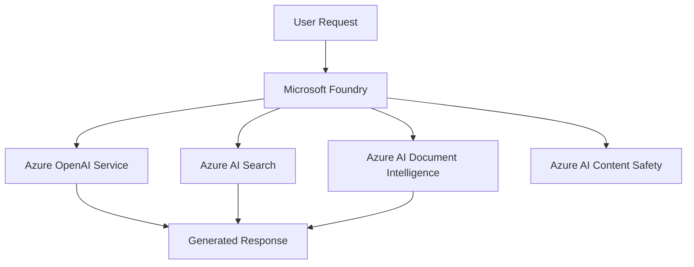
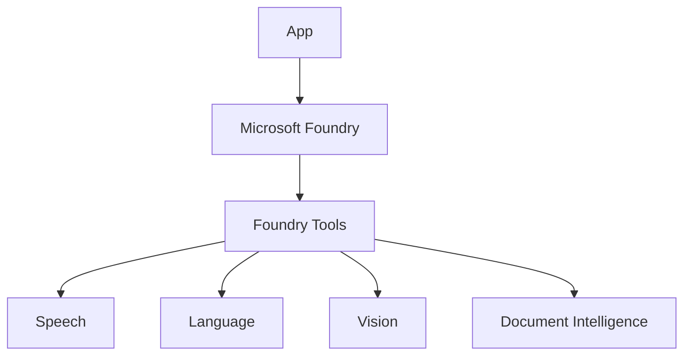

# Microsoft Foundry

Microsoft Foundry is the workspace for building, testing, and governing AI apps and agents. In AI-103, it helps you organize model use, agent workflows, and related tools in one place.

## Role in AI-103

Use Microsoft Foundry when the scenario is about building an AI solution end to end rather than calling a model in isolation. It shows up when you need agent orchestration, knowledge grounding, evaluation, or operational control around the app.

## Key capabilities

- Create and manage AI projects and agent workflows: Keeps solution work organized in one place.
- Connect models, knowledge sources, and tools: Links the app to the services it needs.
- Track agent behavior and evaluation results: Helps you inspect runs and measure quality.
- Use the platform as a control plane for AI app development: Gives you a central place to govern the solution.

## Relationships to other services

Microsoft Foundry often sits above the model and data services in an AI solution.

| Service | Relationship |
| --- | --- |
| Azure OpenAI Service | Provides the models that Foundry solutions call for chat, generation, and embeddings. |
| Azure AI Search | Provides retrieval for grounded answers and knowledge-based agents. |
| Azure AI Document Intelligence | Extracts text and structure from files before Foundry routes the data into an app or agent flow. |
| Azure AI Content Safety | Adds moderation and safety checks for prompts and outputs. |
| Foundry Tools | Groups speech, language, vision, and document capabilities under one shared resource that Foundry can use. |
| Azure Monitor | Captures operational telemetry and health signals. |

Foundry orchestrates these services in one workflow.

- Build agents and app workflows around models, retrieval, document extraction, and safety.
- Use Foundry when you need orchestration, evaluation, and governance around the solution.

Foundry can also use a shared AI resource when an app needs several built-in AI capabilities.

- Use Foundry Tools when the solution needs one shared resource for multiple AI capabilities.
- Keep it in the Foundry page because it is a deployment and orchestration choice, not a standalone service.

## Security and identity

- Use Microsoft Entra ID for sign-in and authorization.
- Store secrets and connection values in Azure Key Vault.
- Apply role-based access control to separate builders, testers, and operators.
- Use private networking when the deployment requires tighter isolation.

## Trade-offs and limits

| Consideration | Why it matters |
| --- | --- |
| Platform scope | Foundry is the control plane, not the model itself. |
| Service coupling | Most real solutions still depend on Azure OpenAI Service, Azure AI Search, or both. |
| Governance needs | The more people and agents you add, the more important access control and telemetry become. |

## Official references

- [Microsoft Foundry documentation](https://learn.microsoft.com/azure/ai-studio/)
- [Foundry agent service overview](https://learn.microsoft.com/azure/ai-studio/agents/overview)
- [Foundry observability and evaluation](https://learn.microsoft.com/azure/foundry/observability/how-to/trace-agent-setup)