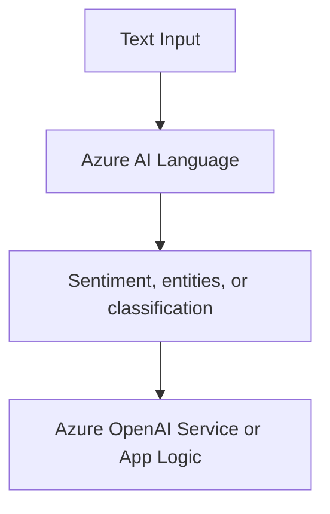

# Azure AI Language

Azure AI Language helps applications understand text. In AI-103, it appears in scenarios such as intent detection, sentiment analysis, entity extraction, and text classification.

## Role in AI-103

Use Azure AI Language when the scenario focuses on analyzing text rather than generating new text. It is a good fit when an app needs to classify, route, or extract meaning from user input or stored content.

## Key capabilities

- Sentiment analysis: Detects whether text is positive, negative, or neutral.
- Named entity recognition: Finds people, places, organizations, and other named items.
- Key phrase extraction: Pulls out the main topics and important phrases.
- Text classification and intent-style analysis: Sorts text into categories or intent-like labels.

## Relationships to other services

| Service | Relationship |
| --- | --- |
| Microsoft Foundry | Adds text analysis to a broader app or agent workflow. |
| Azure OpenAI Service | Can complement generated text with text analysis tasks. |
| Azure AI Search | Can help classify or enrich indexed content. |

Language usually adds analysis around the text path.

- Use it when the app needs text analysis before routing, summarizing, or generating a response.
- Pair it with Azure OpenAI Service when the workflow needs both analysis and generation.

## Security and identity

- Use Microsoft Entra ID where the app flow supports it.
- Store keys and endpoints in Azure Key Vault.

## Trade-offs and limits

| Consideration | Why it matters |
| --- | --- |
| Text quality | Short or noisy text can reduce the quality of analysis. |
| Task choice | Some scenarios need language analysis, not generation. |
| Workflow placement | The service often sits before or alongside model calls. |

## Official references

- [Azure AI Language documentation](https://learn.microsoft.com/azure/ai-services/language-service/)
- [Language service overview](https://learn.microsoft.com/azure/ai-services/language-service/overview)