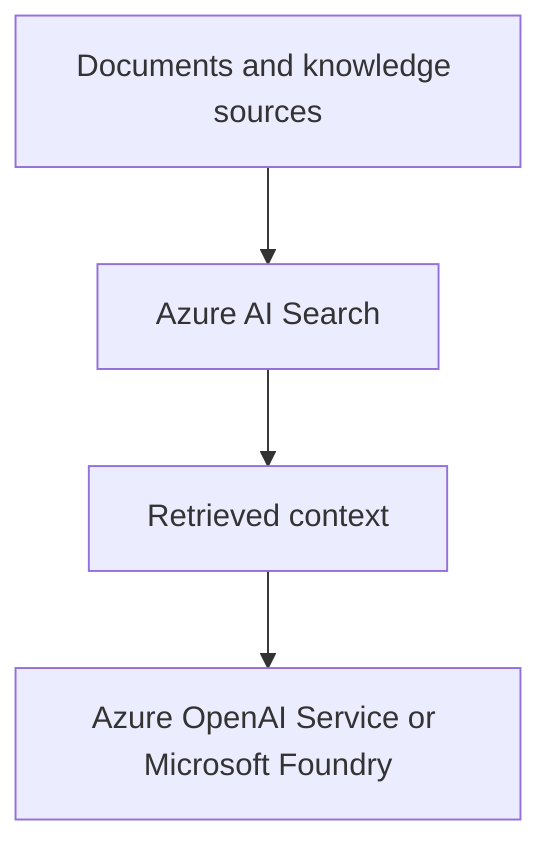

# Azure AI Search

Azure AI Search is a search and retrieval service for application content. In AI-103, it is the main service for grounding responses in your own data and for combining text, vector, and hybrid retrieval.

## Role in AI-103

Use Azure AI Search when the app needs to answer from documents, knowledge bases, or structured content that is not stored in the model itself. It is central to retrieval-augmented generation scenarios.

## Key capabilities

- Full-text search for keyword-based retrieval: Finds matches by words and phrases.
- Vector search for similarity matching: Finds content that is close in meaning.
- Hybrid search for combined lexical and vector retrieval: Blends keyword and vector results in one query.
- Indexing pipelines for documents and knowledge sources: Ingests content so it can be searched later.

## Relationships to other services

Azure AI Search is the retrieval layer that often feeds Foundry and Azure OpenAI Service.

| Service | Relationship |
| --- | --- |
| Azure OpenAI Service | Uses embeddings and retrieved context for grounded generation. |
| Microsoft Foundry | Uses retrieval to ground agents and app workflows in indexed content. |
| Azure AI Document Intelligence | Feeds extracted document text into indexes for search-backed scenarios. |
| Azure AI Content Safety | Can protect the app that reads or writes search-backed content. |
| Azure Monitor | Helps track query latency, errors, and usage patterns. |

Azure AI Search usually sits in the retrieval path between source content and the model.

- Use Search when the app needs grounding from indexed content.
- Use Document Intelligence first when the source content starts as scans, forms, or PDFs.

## Security and identity

- Use Microsoft Entra ID where the client and service support it.
- Store indexing credentials in Azure Key Vault.
- Restrict access with role-based access control and network controls.
- Protect source content if the search index contains sensitive data.

## Trade-offs and limits

| Consideration | Why it matters |
| --- | --- |
| Index design | Poor chunking or field design weakens retrieval quality. |
| Cost and size | More documents and richer indexes increase cost and management work. |
| Retrieval choice | Keyword search, vector search, and hybrid search solve different problems. |

## Official references

- [Azure AI Search documentation](https://learn.microsoft.com/azure/search/)
- [Vector search overview](https://learn.microsoft.com/azure/search/vector-search-overview)
- [Agentic retrieval overview](https://learn.microsoft.com/azure/search/agentic-retrieval-overview)