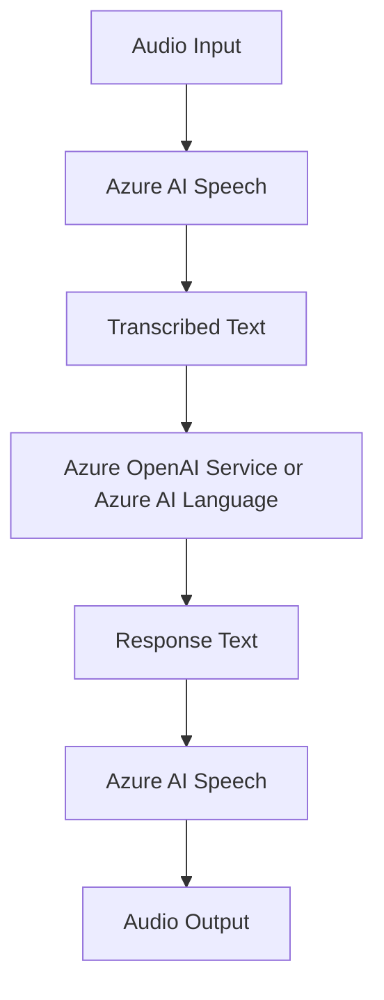

# Azure AI Speech

Azure AI Speech converts spoken language to text and text to spoken output. In AI-103, it is the service for voice experiences, transcription, and speech-enabled assistants.

## Role in AI-103

Use Azure AI Speech when the scenario includes microphone input, transcription, or spoken responses. It is common in assistants, call-center tools, and voice-first applications.

## Key capabilities

- Speech-to-text transcription: Turns spoken audio into text.
- Text-to-speech synthesis: Reads text back as spoken audio.
- Speech translation: Converts spoken language into another language.
- Speaker-related and voice-enabled scenarios: Supports identification, diarization, and voice app patterns.

## Relationships to other services

| Service | Relationship |
| --- | --- |
| Microsoft Foundry | Adds voice input or output to a broader app or agent workflow. |
| Azure OpenAI Service | Can turn transcribed text into generated responses. |
| Azure AI Language | Can analyze the transcribed text. |

Speech usually connects voice input to text processing and voice output.

- Use Speech when the app needs voice input, voice output, or both.
- Send transcription to OpenAI or Language when the workflow needs generation or analysis before speaking back.

## Security and identity

- Use Microsoft Entra ID where the app flow supports it.
- Store keys and endpoints in Azure Key Vault.

## Trade-offs and limits

| Consideration | Why it matters |
| --- | --- |
| Audio quality | Noise and accents affect transcription quality. |
| Latency | Real-time voice scenarios depend on response speed. |
| Workflow choice | Some exam questions focus on voice input, not model output. |

## Official references

- [Azure AI Speech documentation](https://learn.microsoft.com/azure/ai-services/speech-service/)
- [Speech service overview](https://learn.microsoft.com/azure/ai-services/speech-service/overview)