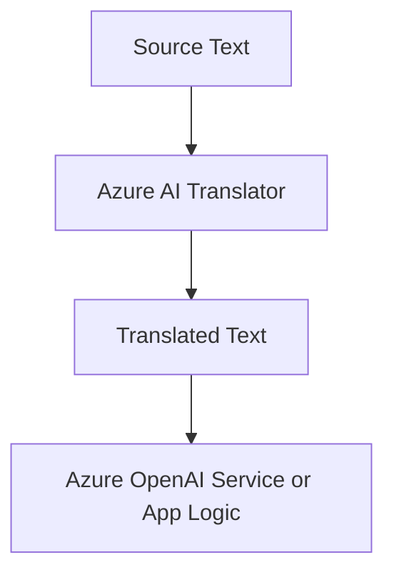

# Azure AI Translator

Azure AI Translator converts text between languages. In AI-103, it is the service for multilingual experiences, localization, and translation workflows.

## Role in AI-103

Use Azure AI Translator when the scenario needs one language changed into another without changing the rest of the app flow. It is common in support apps, content apps, and multilingual assistants.

## Key capabilities

- Text translation: Converts text from one language to another.
- Language detection: Identifies the language of the input text.
- Multilingual content support: Helps apps work across several languages.
- Integration with other AI workflows: Lets translation sit inside a larger app flow.

## Relationships to other services

| Service | Relationship |
| --- | --- |
| Microsoft Foundry | Adds translation to a broader app or agent workflow. |
| Azure OpenAI Service | Can generate or rewrite translated text. |
| Azure AI Language | Can help analyze text before or after translation. |

Translator sits in a simple language conversion step.

- Use Translator when the workflow needs language conversion rather than content generation.
- Pair it with OpenAI or Language when the translated text still needs reasoning or analysis.

## Security and identity

- Use Microsoft Entra ID where the app flow supports it.
- Store keys and endpoints in Azure Key Vault.

## Trade-offs and limits

| Consideration | Why it matters |
| --- | --- |
| Language quality | Translation quality varies by language pair and context. |
| Workflow fit | Translation is often one step in a larger app flow. |
| Exam focus | Know when to translate text versus generate a new response. |

## Official references

- [Azure AI Translator documentation](https://learn.microsoft.com/azure/ai-services/translator/)
- [Translator service overview](https://learn.microsoft.com/azure/ai-services/translator/text-translation-overview)