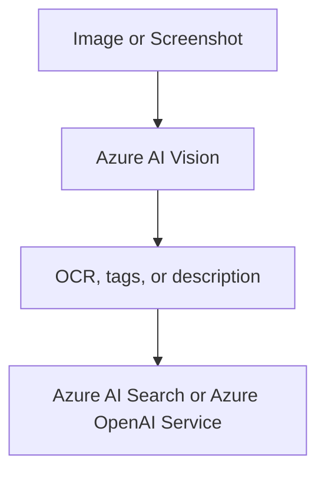

# Azure AI Vision

Azure AI Vision analyzes images and other visual content. In AI-103, it helps with image classification, OCR, object-related scenarios, and visual understanding.

## Role in AI-103

Use Azure AI Vision when the scenario starts with images, screenshots, or scanned visuals. It is useful when the question asks how to understand the content of an image before another service uses it.

## Key capabilities

- Image analysis: Describes what is in an image.
- OCR for text in images: Reads text from screenshots, photos, and scans.
- Object and scene-related insights: Identifies objects, scenes, and visual context.
- Visual content tagging: Assigns labels that make image content easier to search or classify.

## Relationships to other services

| Service | Relationship |
| --- | --- |
| Microsoft Foundry | Adds image understanding to a broader app or agent workflow. |
| Azure AI Search | Can enrich or index visual content that was analyzed first. |
| Azure OpenAI Service | Can turn visual insights into generated responses or summaries. |

Vision usually turns images into text or structured insights first.

- Use Vision when the workflow starts with images, screenshots, or scanned visuals.
- Pass the extracted content to Search or OpenAI when the app needs retrieval or generated output.

## Security and identity

- Use Microsoft Entra ID where the app flow supports it.
- Store keys and endpoints in Azure Key Vault.

## Trade-offs and limits

| Consideration | Why it matters |
| --- | --- |
| Image quality | Resolution and lighting affect analysis quality. |
| Scenario fit | Vision is for understanding images, not for text-only tasks. |
| Workflow placement | It often runs before downstream retrieval or generation. |

## Official references

- [Azure AI Vision documentation](https://learn.microsoft.com/azure/ai-services/computer-vision/)
- [Vision service overview](https://learn.microsoft.com/azure/ai-services/computer-vision/overview)