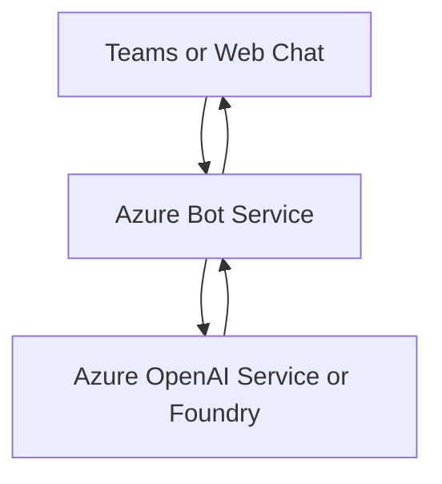

# Azure Bot Service

Azure Bot Service connects bot experiences to channels and chat surfaces. In AI-103, it is useful when the scenario needs a bot container or channel integration around a conversational app.

## Role in AI-103

Use Azure Bot Service when the exam question is about deploying or connecting a bot to a channel such as Teams or a web chat surface. It often wraps a broader AI workflow rather than replacing the model or retrieval service.

## Key capabilities

- Channel connectivity: Connects a bot to chat surfaces such as Teams or web chat.
- Bot hosting and routing: Receives messages and routes them to the bot logic.
- Conversation entry points: Gives users a place to start and continue a conversation.
- Integration with other AI services: Lets the bot call search, models, or other services.

## Relationships to other services

| Service | Relationship |
| --- | --- |
| Microsoft Foundry | Can sit behind a bot experience that calls into a broader AI workflow. |
| Azure OpenAI Service | Can provide generated responses for the bot. |
| Azure AI Search | Can ground bot answers in indexed content. |

Bot Service routes messages between channels and the AI workflow.

- Use Bot Service when the app needs channel integration and conversation routing.
- Combine it with OpenAI or Foundry when the bot must generate or ground responses.

## Security and identity

- Use Microsoft Entra ID where the app flow supports it.
- Store keys and connection values in Azure Key Vault.

## Trade-offs and limits

| Consideration | Why it matters |
| --- | --- |
| Channel scope | Bot Service handles channels, not the core intelligence itself. |
| Workflow fit | Some scenarios only need a web app, not a bot framework. |
| Exam focus | Know the difference between the chat surface and the model layer. |

## Official references

- [Azure Bot Service documentation](https://learn.microsoft.com/azure/bot-service/)
- [Bot Service overview](https://learn.microsoft.com/azure/bot-service/bot-service-overview-introduction)