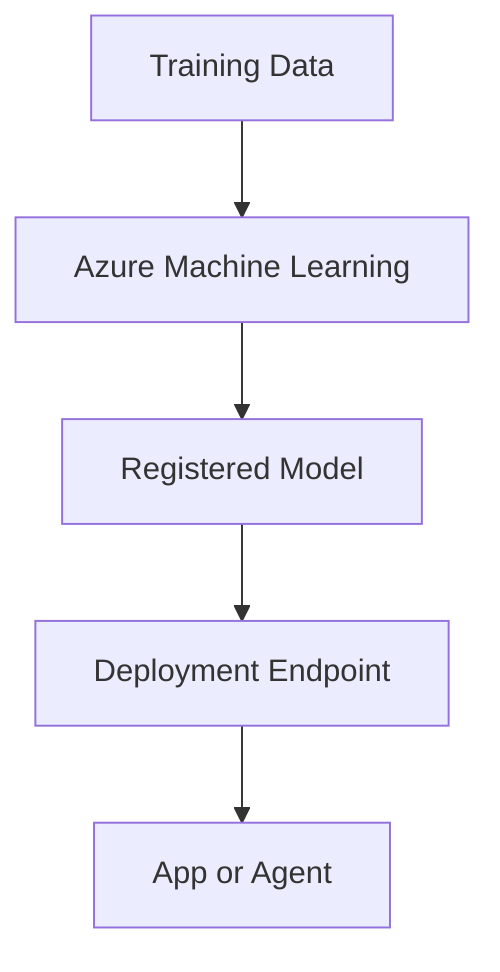

# Azure Machine Learning

Azure Machine Learning helps train, manage, and deploy machine learning workloads. In AI-103, it matters when the scenario is about custom model training, evaluation, or operational ML pipelines.

## Role in AI-103

Use Azure Machine Learning when the question is about training or managing ML models rather than calling an existing hosted model. It is the right choice when the workflow needs model lifecycle management.

## Key capabilities

- Training jobs and experiments: Runs model training and compares results.
- Model registry and deployment: Stores models and publishes them for use.
- Automated or managed ML workflows: Orchestrates repeatable machine learning tasks.
- Evaluation and operational management: Helps you assess and manage models over time.

## Relationships to other services

| Service | Relationship |
| --- | --- |
| Microsoft Foundry | Can sit alongside Foundry when the solution needs custom ML work in addition to app orchestration. |
| Azure OpenAI Service | Serves a different model strategy than managed custom ML training. |
| Azure AI Search | Can help retrieve data that supports ML or agent workflows. |

Machine Learning usually handles training and deployment before inference reaches the app.

- Use Machine Learning when the workflow needs custom model training, evaluation, or deployment.
- Pair it with Foundry or OpenAI when custom models are part of a broader AI solution.

## Security and identity

- Use Microsoft Entra ID where the app flow supports it.
- Store secrets and connection values in Azure Key Vault.

## Trade-offs and limits

| Consideration | Why it matters |
| --- | --- |
| Workflow depth | ML adds training and deployment overhead. |
| Exam fit | Use it for custom model lifecycle questions, not simple chat hosting. |
| Operational cost | Training and serving add cost and management work. |

## Official references

- [Azure Machine Learning documentation](https://learn.microsoft.com/azure/machine-learning/)
- [Azure Machine Learning overview](https://learn.microsoft.com/azure/machine-learning/overview-what-is-azure-machine-learning)