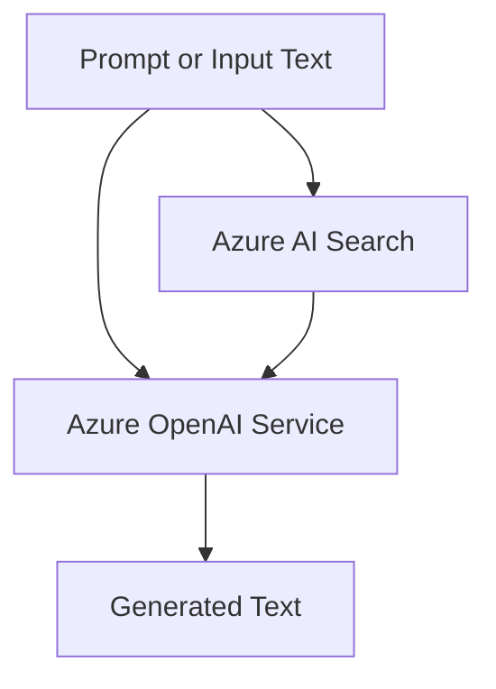

# Azure OpenAI Service

Azure OpenAI Service provides access to Azure-hosted OpenAI models through Azure APIs. In AI-103, it is the main service for generating text, supporting chat experiences, and producing embeddings for retrieval workflows.

## Role in AI-103

Use Azure OpenAI Service when the exam scenario asks you to call a model directly, build a chat app, or create embeddings for search and grounding. It is usually one part of a larger solution, not the whole solution.

## Key capabilities

- Chat and completion style model calls: Produces conversational or generated text responses.
- Embeddings for semantic retrieval and similarity search: Turns text into vectors for retrieval workflows.
- Fine-tuning or model customization where supported by the current service offer: Adapts a model to a narrower task when supported.
- Content generation for copilots, assistants, and agent workflows: Powers the responses those experiences show to users.

## Relationships to other services

Azure OpenAI Service usually supplies the model call inside a larger app or agent workflow.

| Service | Relationship |
| --- | --- |
| Microsoft Foundry | Hosts the wider app or agent workflow around the model call and may call Azure OpenAI Service for chat or embeddings. |
| Azure AI Search | Supplies retrieved context for grounded answers. |
| Azure AI Document Intelligence | Extracts content that can later be summarized, classified, or embedded by Azure OpenAI Service. |
| Azure AI Content Safety | Filters prompts and responses before or after model use. |
| Azure Key Vault | Stores API keys, endpoint values, and other secrets. |

Azure OpenAI Service often sits in the middle of a generation pipeline.

- Use Azure OpenAI Service when the app needs chat, completion, or embedding output.
- Pair it with Azure AI Search for grounded generation and with Foundry for orchestration.

## Security and identity

- Prefer Microsoft Entra ID when the client and deployment support it.
- Use Azure Key Vault for secrets and connection strings.
- Control model access with role-based access control and network settings.
- Treat prompt data and output text as sensitive when the scenario requires it.

## Trade-offs and limits

| Consideration | Why it matters |
| --- | --- |
| Regional availability | Not every model and deployment option is available in every region. |
| Rate limits and quotas | Throughput affects latency, concurrency, and scaling choices. |
| Model choice | The right model depends on task quality, cost, and response shape. |

## Official references

- [Azure OpenAI Service documentation](https://learn.microsoft.com/azure/ai-services/openai/)
- [Azure OpenAI model concepts](https://learn.microsoft.com/azure/ai-services/openai/concepts/models)
- [Azure OpenAI data, privacy, and security](https://learn.microsoft.com/azure/ai-services/openai/concepts/data-privacy)