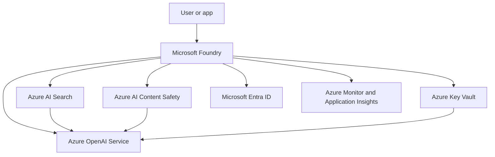

# Plan and manage an Azure AI solution

This module covers the decisions you make before you build an AI app. It focuses on choosing the right Azure AI services, connecting them safely, and keeping the solution observable and maintainable.

## Overview

The exam expects you to understand how an Azure AI solution fits together from the start. You need to know when to use the platform for agent building, when to call a model directly, when to add retrieval, and when to add guardrails or monitoring.

## Key concepts

- [Microsoft Foundry](../../azure-services/azure-ai-foundry.md) provides the workspace for building, organizing, and governing AI apps and agents.
- [Azure OpenAI Service](../../azure-services/azure-openai.md) provides model access for text and multimodal generation, reasoning, and embedding-based workflows.
- [Azure AI Search](../../azure-services/azure-ai-search.md) adds retrieval for grounded answers, vector search, and hybrid search.
- [Azure AI Content Safety](../../azure-services/azure-ai-content-safety.md) filters risky input and output.
- [Azure Key Vault](../../azure-services/azure-key-vault.md) stores secrets, keys, and connection values.
- [Microsoft Entra ID](../../azure-services/microsoft-entra-id.md) provides identity and access control.
- [Azure Monitor](../../azure-services/azure-monitor.md) and [Application Insights](../../azure-services/application-insights.md) capture telemetry, traces, and operational signals.

## How the core services fit together

## Core workflows

1. Define the app goal and decide whether you need chat, extraction, search, or agent orchestration.
2. Choose the model path in [Azure OpenAI Service](../../azure-services/azure-openai.md) or the agent path in [Microsoft Foundry](../../azure-services/azure-ai-foundry.md).
3. Add [Azure AI Search](../../azure-services/azure-ai-search.md) when the answer must use your own documents or data.
4. Add [Azure AI Content Safety](../../azure-services/azure-ai-content-safety.md) when you need prompt and response filtering.
5. Store secrets in [Azure Key Vault](../../azure-services/azure-key-vault.md) and use [Microsoft Entra ID](../../azure-services/microsoft-entra-id.md) where possible.
6. Add [Azure Monitor](../../azure-services/azure-monitor.md) and [Application Insights](../../azure-services/application-insights.md) before the first pilot release.

## Exam decision factors

| Need | Best fit | Why |
| --- | --- | --- |
| Build and govern an AI app or agent | [Microsoft Foundry](../../azure-services/azure-ai-foundry.md) | It gives you the workspace, tools, and operational controls.
| Call a model directly | [Azure OpenAI Service](../../azure-services/azure-openai.md) | It gives you managed access to model deployments and APIs.
| Ground answers in your content | [Azure AI Search](../../azure-services/azure-ai-search.md) | It indexes and retrieves source data for RAG scenarios.
| Block unsafe input or output | [Azure AI Content Safety](../../azure-services/azure-ai-content-safety.md) | It adds moderation and risk detection.
| Store secrets and keys | [Azure Key Vault](../../azure-services/azure-key-vault.md) | It keeps credentials out of code and config files.

## Security, governance, and monitoring

- Use [Microsoft Entra ID](../../azure-services/microsoft-entra-id.md) for identity and role-based access control.
- Keep secrets out of source files and store them in [Azure Key Vault](../../azure-services/azure-key-vault.md).
- Add network isolation and private access where the scenario requires it.
- Capture telemetry early with [Azure Monitor](../../azure-services/azure-monitor.md) and [Application Insights](../../azure-services/application-insights.md) so you can measure failures, latency, and usage patterns.
- Review the safety path for both user prompts and generated responses with [Azure AI Content Safety](../../azure-services/azure-ai-content-safety.md).

## Official resources

- [Microsoft Foundry documentation](https://learn.microsoft.com/azure/ai-studio/)
- [Azure OpenAI Service documentation](https://learn.microsoft.com/azure/ai-services/openai/)
- [Azure AI Search documentation](https://learn.microsoft.com/azure/search/)
- [Azure AI Content Safety documentation](https://learn.microsoft.com/azure/ai-services/content-safety/)
- [Azure Key Vault documentation](https://learn.microsoft.com/azure/key-vault/general/)
- [Azure Monitor documentation](https://learn.microsoft.com/azure/azure-monitor/)
- [Application Insights observability overview](https://learn.microsoft.com/azure/azure-monitor/app/app-insights-overview)